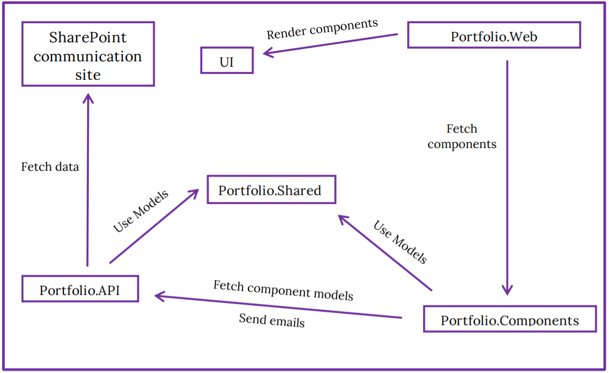

# Digital Portfolio - Built using ASP.NET Core Blazor (Server)

**Creation date: 2020-05-14**

A digital portfolio using Blazor Server (C#) and a SharePoint communication site as a Content Management System. This was my graduation project for the educational programme "Programutveckling .NET med SharePoint-inriktning" at Nackademin.

The solution consists of four different projects:

* Portfolio.API – ASP.NET Core Web Application (Web API)
* Portfolio.Components – Razor Class Library
* Portfolio.Shared – Class Library (.NET Standard)
* Portfolio.Web – Blazor App (Server)

Here is an overview of what the different project types are responsible for:

Here is a sample from the desktop view:

Here is a sample from the mobile view:

